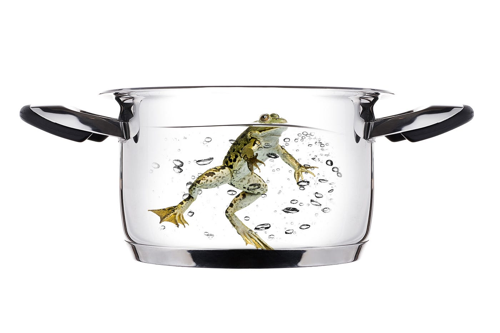

## Who owns the digital you?

What price freedom? It seems we're willing to trade our civil liberties to gain access to a handful of popular web services. Are we even aware we're dancing with the devil?

As consumers, we've come to expect the services we use on the internet to be free. Things we'd have expected to pay for in the past; news, video, mail, text messaging, pretty much everything, now seemingly comes without a price.

Just imagine having to pay…. but since we're not, someone, somewhere must be paying….right? Who's paying the content creators? Who's paying the creative technologists? Who's paying for the infrastructure to run these services?

> "If you're not paying, you're the product"

## The emergence of a new business model

If we're the "product" then who is the customer? Brands and corporates; advertising, right? That's a well established traditional business model. We've seen this before, it's familiar, we expect to see adverts, we expect to see them on billboards when we're driving, we expect to see them in newspapers and magazines, and we expect to see them on our televisions. So, seeing them next to our search results, or in our Facebook news feeds shouldn't come as a surprise. It's certainly nothing new. In fact, I'm pretty sure that we're all willing to accept this minor intrusion as a fair trade-off to get the services we've come to depend upon for "free".

From the outside this looks like nothing new, except there *is* something new. Do you remember having to agree to any Terms and Conditions when you bought your newspaper, watched your television or looked up at a billboard? No, of course not. Because you didn't have to. When you purchased your newspaper, did the publisher gain access to personal information about you? Were they aware of the articles you actually read, how long you spent reading them, where you were when you read it, what you did after you'd finished reading it, what you thought of the articles, and who you discussed your thoughts with? Of course not, that would be ludicrous — there isn't the manpower to spy on everyone.

The internet is different. Whether you explicitly accepted the terms and conditions of a site or a service by clicking a button to say "I agree" or not — and let's face it that would have required you to have read the T&Cs, which nobody does — we have all implicitly agreed; usage of a service constitutes agreement.

> "By using our services, you are agreeing to these terms. Please read them carefully."

## Corporate Surveillance

If we're the product then what are we worth? Current estimates would say that each user is worth $500 a year to Google. But what makes you so valuable? It is the rich and revealing user profiles they have on who you are, what you do, what you like, where you live and who your friends are. This is something companies who want to sell you something, care about. The more they know about you the more valuable you are to them.

How do they get to understand you better? They do it through their services. On day one there was just search, and this is how it all started. They [Google] were going to make the world's information discoverable, then they found/borrowed/copied a business model where a user's intent could be monetised through advertising. Since then they've been on a mission to better understand their users, all in the name of providing a better service (to their advertisers). If the model was to monetise their users then they needed more of this data to grow, and so they released and acquired ever more services, Gmail, Calendar, Maps, Youtube, Talk, Hangout, Drive, Google Plus, etc….

Something's missing though. They're a software business, not hardware so how do they get to be with you all the time? Ahh… Android. They develop an open source operating system for mobile to compete with Apple and IOS and now they're utilising handset manufacturers; Samsung, Sony, HTC, and Motorola (later acquired by Google). Almost 80% of the worlds smartphones now run Android (April 2014). What's the authentication system to access the plethora of services and features? That's right, it's your Google name and password. So, now they can identify you on the move.

So, very accomplished at getting their Operating System and authentication/snooping system into the hands of so many, something is still missing though. They're not in complete control. The solution? Launch your own [competing phone](http://www.google.co.uk/nexus/5/), which is a great phone, but retails at half the price of an iPhone. Is it half the phone? No, it's not, but they want one in your hands so they're subsidising it, because the phone's not important, what it tells them about you is what they're interested in.

Google has already mapped the outside world, they've done it with cars and where cars can't go they've done it with [things strapped to people's backs](https://www.google.co.uk/maps/about/partners/streetview/trekker/). But there's still somewhere they can't go, your private space, your house, your bedroom. Oh wait, they've thought of that too, introducing [Project Tango](https://www.google.com/atap/projecttango/); a project to utilise the phone to map your spaces. Perhaps this is a handy service, like the cars that drive themselves. Perhaps they are an enabler for blind people…… I'm sure that's a side effect and the marketing message, but it's not the real driver. You can take that straight off their project site — remember, the more they know about you the more valuable you are to their customers.

> "What if you could capture the dimensions of your home simply by walking around with your phone before you went furniture shopping?"

It doesn't end here either, Google Glass, The internet of things. They sure [paid a lot for a maker of Thermostats](http://online.wsj.com/news/articles/SB10001424052702303595404579318952802236612) and subsequently a [maker of home surveillance products](http://www.cnet.com/uk/news/googles-nest-labs-acquires-dropcam-for-555m/)….

> "If you have something that you don't want anyone to know, maybe you shouldn't be doing it in the first place." — Eric Schmidt (2010; Chairman of Google)

## Why should we care about Privacy?

It's worth taking a few seconds to consider your own thoughts on this statement. Are you happy with everything that you do in your life being shared with other people? Every conversation, every moment, and I mean ***every moment***; intimate moments with your partner, would you like to share those with other people? If not, perhaps as Mr Schmidt suggests, you shouldn't be engaging in them….

The thing with privacy is it's complex, it's built up of a number of elements that resemble each other, but at the core are not the same, it cannot be reduced to a single idea, and it is this complexity that makes it difficult to reason about. I'm not going to make this an examination of what privacy means, but instead I'm proposing that we have the right to control elements of our lives, we have the right to decide what we share, and who we share that with.

Control is what is important, this is not a case for "if you have nothing to hide", everybody does, we show some people some things, and others see a different side. There is no authentic you, we all alter behaviour to a greater and lesser extent depending upon the environment. I'd expect that you may swear in the company of friends, and are (hopefully) less likely to do so in-front of your mother. It's still the same you, just tailored.

What happens when you lose this control? When you inadvertently hand it to someone else? What happens when your data is leaked? The companies tell us that the data they hold is anonymised, so there's nothing to worry about. If it is leaked you can't be traced, they say.

Back in 2006, AOL released (intentionally) anonymous search data of more than 650,000 of it's users. It didn't take long, using this information, to begin identifying people. First up user 4417749, Thelma Arnold a 62 year old widow from Lilburn, Georgia. Nothing too interesting there other than the fact it only took a couple of hours to identify her.

User 17556639; was a different case entirely, they had been performing some interesting searches "how to kill your wife", "dead people", "pictures of dead people", "decapitated photos". The internet was quick to judge, someone was intending to commit a crime and something needed to be done. It turns out that the user 17556639 is Jerome Schwartz, and I can happily report that is wife is still alive. Why was he searching for such things? Do we have the right to ask why? At the time he was a writer on a crime show called Cold Case; he was doing research for his job. What if this was the government looking at this data, taken out of context should they be taking preventative actions? Putting a flag against this person as a possible threat? [Minority Report here we come](http://en.wikipedia.org/wiki/Minority_Report_%28film%29).

We've never faced a loss of control on this scale ever before, but I'm afraid that we're sleepwalking into an irreversible situation. [There's a fitting anecdote about boiling a frog](http://en.wikipedia.org/wiki/Boiling_frog), that goes like this; placing a live frog in a pan of water *(don't try this at home, cruelty to animals cannot be condoned),* and then very slowly increasing the heat over time results in the frog boiling to death as it's incapable of sensing the impending doom it faces and leaping to safety. People are a little bit like this too, we're either unable or unwilling to react to significant changes that occur gradually. With each passing day our civil liberties are eroded just that little bit more, and one day we're going to wake up and wonder how we got this far down the road.

> "If one would give me six lines written by the hand of the most honest man, I would find something in them to have him hanged" — [Cardinal Richeliue](http://en.wikipedia.org/wiki/Cardinal_Richelieu)

## Government

In one respect things haven't really changed much since 17th century France; Governments have become more bloated, perform more functions, and have the best interests of the citizen at heart *ahem*. No longer do they need to rely on a mere six handwritten lines. After many years increasing their reach into our lives, they've stumbled upon an answer to their prying prayers. It's expensive and difficult monitoring everybody all of the time. They simply didn't have the budgets, manpower or nous. Thankfully, for them, we've helped them out. Posting your whereabouts, thoughts and intentions online whilst carrying around a tracking device (smart-phone) has meant they have you under constant surveillance. The secret is not to collect this data themselves, but to request it from the gatekeepers and this what we now know they did, thanks to [Edward Snowden](http://en.wikipedia.org/wiki/Edward_Snowden). A former systems administrator for the CIA, Snowden decided in 2013 that the American people (and the world) had the right to know of the surveillance programs that had been enacted under the [Patriot Act 2001](http://en.wikipedia.org/wiki/Patriot_Act) in direct response to the terrorist attacks of 9/11. Designed to protect against terrorist acts, these new powers swept aside citizens' rights as enshrined in the constitution.

PRISM, a clandestine mass electronic surveillance program launched in 2007 by the National Security Agency (NSA) [U.S.] reached out to corporations for their data. First on board was Microsoft; September 2007, Yahoo; March 2008, Google; January 2009, Facebook; June 2009, YouTube, Skype, AOL and finally Apple; October 2012.

Not to worry though. If you've got nothing to hide, then you have nothing to worry about. All of us abiding by the letter of the law have nothing to fear from our own Governments. Except I don't know anybody who has never done anything that would be considered wrong by some section of society.

[Take TomTom providing data to the police who then used that data to locate speed traps in locations most likely to catch speeding drivers](http://www.telegraph.co.uk/technology/news/8480195/Police-use-TomTom-data-to-target-speed-traps.html). Subsequently, TomTom's CEO, Harold Goddijn apologised to customers, stating they thought the data would only be used to relieve traffic bottlenecks and improve safety. Speeders are wrong doers, I hear you say, and there is justification for this invasion of privacy, and besides our governments are mostly concerned with doing the right thing by the citizen.

What if these services (Google, Facebook, Microsoft, Apple, etc…) have data about something that you may wish to keep private, is in no way wrong, but is deemed to be so by the country you reside in; [marrying a Christian](http://www.theguardian.com/world/2014/may/25/sudan-pregnant-woman-death-sentence-meriam-yahya-ibrahim-toddler), [being homosexual](http://www.bbc.co.uk/news/world-africa-26532705)? Well you may take this argument and say it doesn't apply because we live under a more liberal rule. Those trusted companies would never turn over your information to those that may not be so liberal? That depends. Facebook has headquarters in Europe and that means that despite being a US company, they are subject to European laws — as utilised by an Austrian student to [request all of the data the company had on him](http://www.businessinsider.com/students-sue-facebook-over-privacy-2012-12). Still, we've nothing to worry about, the corporations are never going to set up HQs in Sudan (Christian woman), Uganda (homosexuality). They're not commercially important enough — today! I'll let you replace those two examples with a couple of larger more financially viable markets with historically poor track records re: human rights measured against our own values.

The thing is, we don't know how the decisions we make today will affect the future, we don't know how laws and public opinion will change, where we will travel, or how information may be used against us — even by our own governments. I'd prefer not to be at the mercy of a future where everything I've ever done could be turned against me, my friends, colleagues or loved ones.

## Business

Earlier on I quoted the well used phrase, *"If you're not paying, then you're the product,"* which is a very binary way to look at the situation. What about business customers? Those using Google Apps for Business. The act of paying for the service surely makes you the customer. Well, kind of… Let's look at the standard costs: $5 per user per month; or, $50 per user per year. That seems very attractive, yet something doesn't add up. If each user is worth approximately $500 per year to Google, then selling the services that they give away for free for $50 seems to make limited business sense. Unless what's happening is they're subsidising the service and you're still the product? **Surely Google wouldn't be scanning your company emails?** Reading your company files? Listening to your voice calls?

OK, perhaps you as a company are still not that bothered that Google is looking at your communications , you've got nothing to hide and they're not going to be interested in your business. But what about the companies that take privacy seriously, they're not comfortable opening up their data to another corporation — a reasonable position to take. So they've decided not to use the service (or another similar cloud solution), it's their right to do so. Unfortunately, that decision isn't solely theirs to make. You may inadvertently be making it for them. Perhaps you're a business using Google Apps, it's on your own domain, and you're communicating with a client who has concerns over privacy. They are blissfully unaware that the emails they send you, the documents they attach, the information that they communicate, is going to be made available to Google because you granted permission to spy on their behalf. I'm sure it's solely in the name of making better products and services for you; what other reason could they have?

These services all have a common prerequisite for spying, they live in the "Cloud"; but what is the Cloud? We've all heard about it and the noise has certainly built to a deafening crescendo in recent years. Simply put; it's a redefinition of everything that we were already doing online. There's nothing new, it's fashionable marketing wrapping up the services we previously used under the ubiquitous marketing title of the "Cloud". The services aren't particularly new, but what is new, and this is the clever bit, the cloud is about moving the control of your digital data from your personal machines and servers to someone elses. Slipped in for good measure is the transfer of your rights over the digital assets from you to them.

Apparently "it's inevitable" this move to the cloud. Unstoppable, and as software freedom activist, [Richard Stallman](http://en.wikipedia.org/wiki/Richard_Stallman) [said](http://www.theguardian.com/technology/2008/sep/29/cloud.computing.richard.stallman) "whenever you hear somebody saying that, it's very likely to be a set of businesses campaigning to make it true". Why do they want your data? Anybody else get the feeling of impending doom that escaped the frog yet? It's been written time and time again by figures in literature, or futuristic social commentators as I like to call them; [Nineteen Eighty Four](http://en.wikipedia.org/wiki/Nineteen_Eighty-Four), [Brave New World](http://en.wikipedia.org/wiki/Brave_New_World), [The Truth Machine](http://en.wikipedia.org/wiki/The_Truth_Machine) (lesser known), surely not [Skynet](http://en.wikipedia.org/wiki/Skynet_%28Terminator%29)?

## Parting Shot

We're in the middle of a technological land grab, pretty much every consumer internet company you can think of has adopted the business model of free. The race is on to **own you**, to build walled gardens where they control what and how you experience the connected world. Your digital identity is not your own, you are not in control of it, it is not yours to decide what to do with. It belongs to corporations and by proxy government, we're selling our digital souls, and we've no idea the price we pay.

This is not a debate about Security versus Privacy, as the corporations and government have positioned it to you. It's the fight between Liberty and Control. We need to re-frame and engage in dialogue and action. If we continue with our eyes wide shut and don't do something soon, the decision will have been made for us, and we will have made it for our children and their children.

Incidentally if you're interested in doing something about it. There are many places to start, but if you're in the UK or can get here, then get yourself along to [The Indie Tech Summit; Brighton July 4th 2014](https://indietech.org/summit/). I'm not sure if that date was chosen as a nod and a wink to a certain significant day in the history of the U.S., or that it's being held in the UK. Either way perhaps I'll see you there.