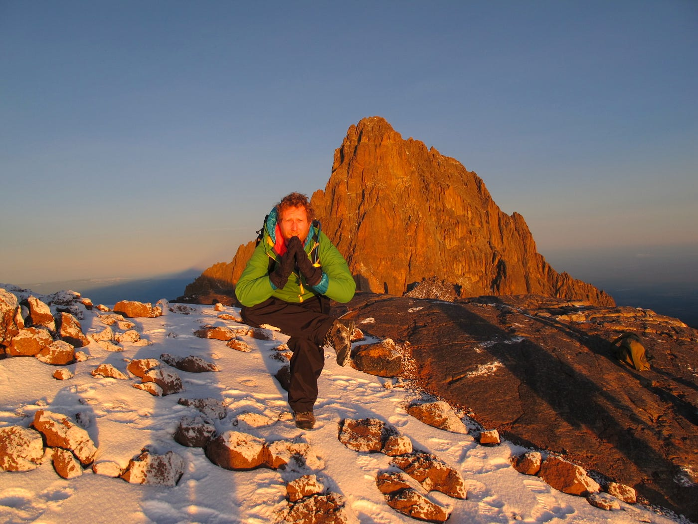
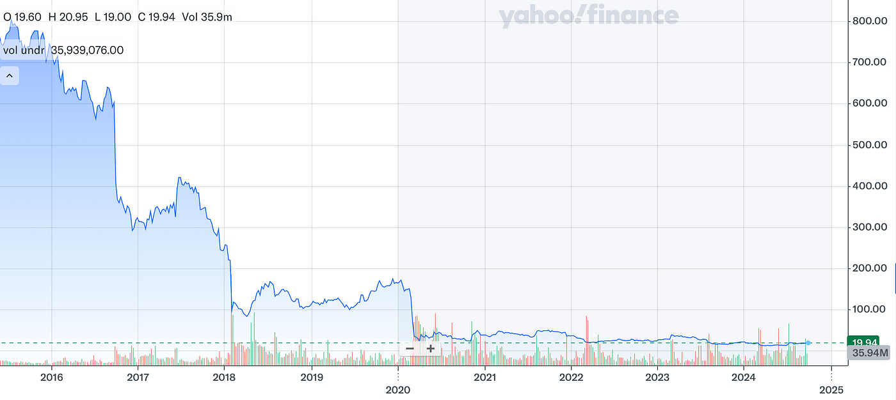

> "We need the tonic of the Wilderness"

After five years in the wilderness, I've found the energy to start making things again.

In 2006, I co-founded Orange Bus, a digital agency hailing from Newcastle-Upon-Tyne, UK. I'm incredibly proud that, together with Julian Leighton (and many others along the way), we built an outstanding agency servicing clients globally in motorsport: Aston Martin Racing, Porsche Motorsport and Force India F1 — supported online learning with Pearson Education, made the lives of UK citizens a little easier with our work in government; HMRC, DWP, the MOJ and MOD, energy, fashion, insurance, finance, entertainment, it's a long and diverse list.

In 2016, we sold to Capita PLC, and for the next few years, life was very different. For starters, I had a wad of cash burning a hole in my pocket, so I did what everyone else does — buy a massive house in the country. Other than that, things were the same, or perhaps not. After a decade of building, something was very different. We couldn't have known this beforehand, but Capita was heading for turbulent times. Within months of being acquired, the company dropped out of the FTSE 100; there was a new CEO, it went from twelve divisions to six, and later to three; it's now just two divisions with someone else at the helm — an endless organisational reshuffle; the people responsible for acquiring us were all gone.

Nevertheless, there was work to be done, and the reasons we chose to sell to Capita still held firm: this organisation with tremendous potential needed a strong digital services offering. It had software and data — there wasn't a private UK company that had more potential to understand the UK citizens' journey, from pre-life to death and all of the touchpoints in between. The opportunities to build incredible products and services were and still are immense.

The initial announcement was that G2G3, a Capita-owned company, acquired Orange Bus. The narrative very quickly changed to this being a core Capita acquisition and that G2G3 Digital would be merged with Orange Bus; what eventually happened was that we effectively reverse-acquired G2G3 Digital, which was the remnants of a 2011 Capita acquisition of Sheffield-based Technophobia. With our increased capacity and new clients, we were on a rip. With G2G3 Digital under our wing, next, we were to acquire a team of 20 plus (a separate part of G2G3) up in Edinburgh working on delivering ChooseCare — Capita's internally funded start-up set to transform Adult Social Services.

We accomplished all of this in a little over three months. Integrating Orange Bus into a corporate behemoth would have been enough of a challenge, never mind acquiring and integrating other Capita companies.

# The honeymoon comes to an end.

It comes crashing down! After taking on the ChooseCare team on Friday and being aware of issues (after all, that's what we were there to fix), ChooseCare (a Capita company) pulled the Statement of Work pending resolution of the issues mentioned earlier. It was not the best start, and the inexperienced leadership team of ChooseCare thought it was fine as we could deploy them on another Orange Bus project — of course, we couldn't. Even if we had the work for 20+ people on Monday (which we didn't), we couldn't just deploy an external team and have them up and running as part of our agency in a day!

The attitude that designers, coders, and those who build things are akin to unskilled labour where any warm body will do and can be swapped out at will was prevalent within Capita. On another G2G3 Digital fix-it relationship on a publicly failing project (Army Recruitment), a discussion revolved around "getting the worker bees" to crank out more code — never mind that they were on their third iteration of building the wrong thing.

As for ChooseCare, we righted the ship, sorted the relationship, and spent the next year delivering software in my new (second) role as their interim CTO. Still, alas, the premise was deeply flawed. In conjunction with delivery, I spent a lot of time at the executive level as division after division, under my advice, tried their best not to be its new home — starting with my own.

# A honeycomb of accountants

After the acquisition, our assigned FD described Capita as a honeycomb of accountants, which goes a long way toward explaining the negative pervasive behaviours.

Our P&L, along with the many other companies, rolled up into our division's P&L, which then rolled up to the company P&L. To manage this was an army of accountants. All of this played out in the monthly MOBs where you had your feet held to the fire over missed targets; it explains the many infights between companies as they tried to shift costs and move profits onto their own balance sheets.

Fortunately, we continued to hit and exceed our targets, but the companies we'd taken under our wing required longer to turn around. We were given the grace of separate P&Ls for a while, but this was short-lived, and soon, three became one. Their underperformance against targets we hadn't been involved in agreeing to was now our problem — not just Orange Bus' problem but directly related to our earnout payments — so this was personal.

I was no longer building great things, but along with Julian, Kris Kennedy, James Hall, and our senior management team, we were doing our best to shield our core from Capita's overarching drive to cut costs as part of £1 billion refinancing. This included raising £700 million from a rights issue and £300 million from disposals and cost-cutting.

# The decline of great companies

Steve Jobs had a theory about why decline happens: The company does a great job, innovates, and becomes a monopoly or close to it in a field — something many of Capita's products had achieved. SIMS had this serving over 80% of English state schools; chronic underinvestment eventually saw this golden egg jettisoned from Capita's portfolio of companies, where its share is now down to 50%. Instead of the quality of the product, Capita valued the salesman — for it is them who can move the needle on revenues, but this will doom a product and company because, in the end, what consumers want is a good product — and no amount of "lipstick on a pig" which we were tasked for doing was going to save it from the slaughterhouse.

It's not just the salespeople. It's also the (honeycomb) of accountants — the money men searching high and low for ingenious ways to cut costs. It's the activities of these two that suck the spirit out of the creators, the product engineers and designers. They favour short-term profits over the long game and are rewarded handsomely as they steer the ship towards the rocks.

*Things don't seem to be improving, and the same strategies look to continue to be pursued. Capita PLC's share price from the date of our acquisition in March 2016 of over 634 pence to 19.94 today, a whopping 96% fall.*

# Capita Consulting

Despite all our challenges, Orange Bus continued its growth after the acquisition, with revenues of £13 million and a team of 150.

In 2019, it became the engine room of the newly formed Capita Consulting. The Orange Bus brand was shuttered, and I'd run my time at a big corporation. I officially left in September 2019, but I'd checked out long before.

# So what next?

That's another story I'll share shortly, but I've had my exit, and I'm not interested in playing that game again. Like Steve Jobs, I want to build and help others "build enduring companies where people are motivated to make great products (and services)."