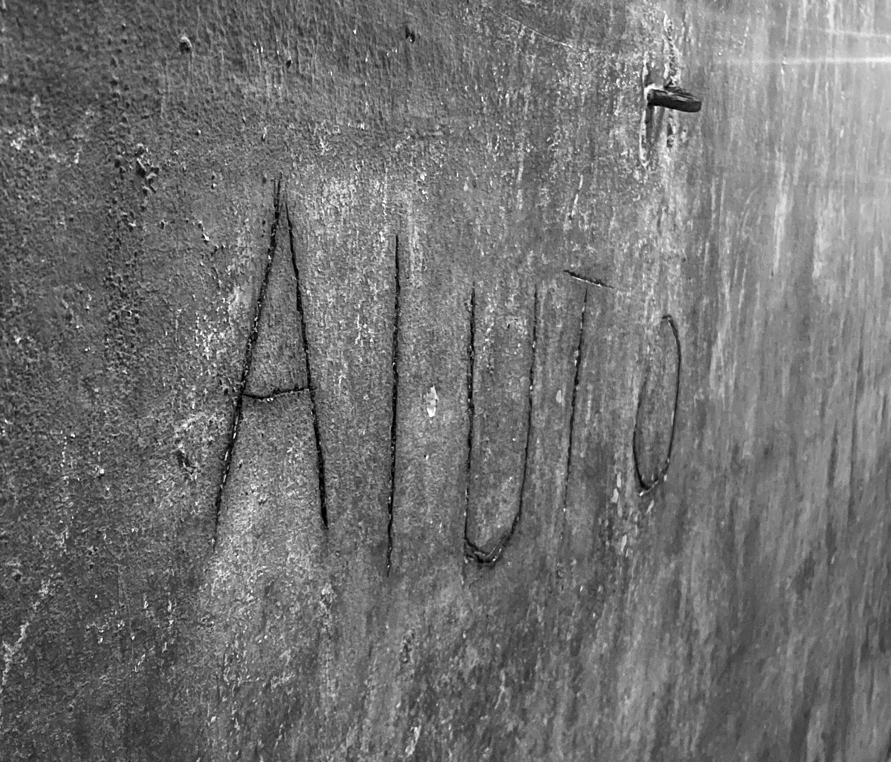

[The Wave That Wonders](/posts/the-wave-that-wonders) never truly left me as I pondered life and consciousness. As we continued our journey, I became acutely aware of how the places we visited subtly influenced my feelings. This reflection brought back memories of how deeply I had connected with places in the past.

## When Places Speak

Some places open you. Others close you. A rare few hum at a frequency that collapses into sudden clarity.

- Naples was interference.
- Thessaloniki? Coherence.
- Scotland—something remembered.
- Newcastle: The Place That Doesn’t Hold

I didn’t need a theory to feel it. I felt it in my breath. In the way my shoulders dropped in the silence that arrived when the inner static cleared. It was like being remembered by the land.

## Naples: Interference

In Naples, the noise wasn’t just traffic or tourists. There was something in the field—a dissonance I couldn’t name. My body registered it before I had words. And then I found them.

That one word—**AIUTO**, Italian for _Help_— 

Etched into the bunker wall, it hit me harder than any theory ever could. It was as if the quantum collapse of a terrified mind had been preserved in limestone. An entangled moment still resonating in the geometry of the city. A localised plea, still echoing in the field. No wonder the rhythm of thought felt scrambled. The waveform had folded in on itself, leaving behind a scar.

<figure style="text-align: center;">
  
  <figcaption style="font-size: 0.9em; color: #666; margin-top: 0.5em;">
    “AIUTO” – Scratched into a wall in a WWII bunker beneath Naples, supposedly by a child, seeking safety underground.
  </figcaption>
</figure>

## Thessaloniki: Coherence

In Thessaloniki, everything shifted. No bracing. No resistance. As if the place and the person were already entangled.

Quantum theory tells us coherence is fragile—Entanglement shatters. Noise drowns signal. But what if some environments attenuate the noise? What if consciousness, as a quantum process, responds to the geometry of the world?

Thessaloniki felt like a bell still ringing long after it had been struck. A place where coherence could hold, if only for a moment.

## Scotland: Something Remembered

Scotland does this too, when I cross the border, a weight lifts. Not nostalgia. Not history. Field geometry. 

Maybe it’s what Federico Faggin calls the  primordial field of consciousness—a knowing field from which form arises. If that’s true, maybe landforms and lineage aren’t separate from thought. Maybe we are localised ripples in a conscious field, and certain places reduce interference just enough for us to remember what we are.

## Newcastle: The Place That Doesn’t Hold

But Newcastle is different. It’s where I’m from, where I live, where I’m supposed to feel at home. And yet the field never settles. The waveform doesn’t stabilise. It ricochets—closed loops, no resonance. Thoughts don’t echo there—they scatter. Ricocheting off walls that were never meant to hold them.

Maybe that’s the root of the restlessness. Of the dissonance I carry. Not knowing how to belong in the place I’m meant to be.

_Naples scattered me._ 
_Thessaloniki held me._ 
_Scotland remembered me._ 
_Newcastle—never quite saw me._ 

And something in that rhythm feels important. Maybe the key isn’t to define who we are but to go where coherence finds us.

Where the waveform settles, where we can unfold—And wonder.
