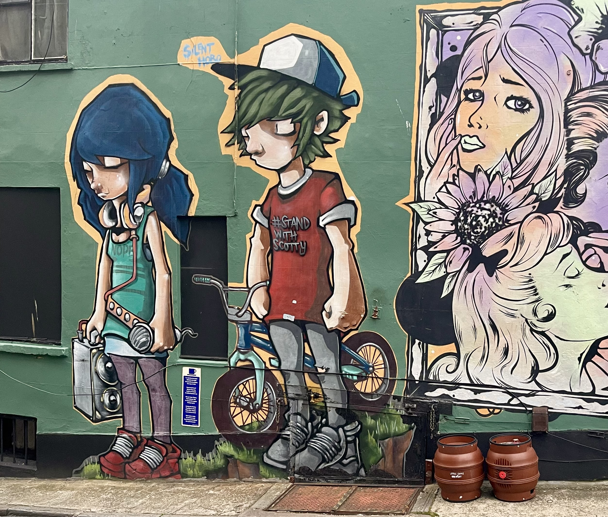

> Morphine and the Myth of Stillness

_A beautiful piece of street graffiti snapped in Bristol while visiting Universities with my daughter_

For years, I called myself high-functioning. Denied that I had a problem.  And, as the world around me collapsed, I continued to deny myself. 

I could build companies, compete in sporting events, raise children, build things that would endure, and stand in front of audiences and inspire. And yet, something was very broken. 

People saw performance; they didn't see the ever-louder static, slowly crushing my soul. The endless whirring of thought, fear and shame that was never quiet, bringing me ever closer to the end.

I haven't spoken much publicly about my struggles with addiction, but I've never hidden them either. As we got through the first round of inhumanely locking people in their homes back in 2020, I came out like a man who’d been holding his breath for a year — desperate for air, for anything that made me feel alive. Within weeks, everything was broken.

Rehab came and went. Then came the relapse — the dark side again. Brushes with the police. More wreckage for the people who still loved me, though I gave them little reason to.

By some grace, I made it through. And with time, and the love of those who refused to give up on me, I found the strength to stop myself.

That was over four years ago, **no more alcohol, no more drugs**.

## The Table to Heaven
I've had many operations during my life — but through this last one, a week ago, I unexpectedly found an answer hiding in the silence.

Lying on the anaesthetist's table, under that white light, the world began to fade away, as that slow liquid mercy—morphine entered my veins, my mind went quiet. Not joy, not a high, just silence, a stillness, clarity and a calm that I haven't experienced for years.

There was a quality to my thoughts that I've so struggled to hear above the incessant chattering of the monkeys running rampant in my mind.

## When the Rush Fades
It was never the rush, never the pleasure that I was seeking. 
I was yearning for a break from myself, an opportunity to close down the endless loops running through my brain. 

For years, I found this peace at the bottom of a glass, in a pill, or at the end of a line. The drugs didn't make me feel alive; they made me stop feeling everything else. They didn't add clarity; they subtracted the interference.

I still struggle to live with myself, but I'm learning: the mute button for the noise of being me isn't found in silence or absence; it's in its alignment.

_I need to thank a few special people, as without them I wouldn't be here today: My sister, Stephanie, the person I called crying when it all became too much, my father and my mother — a sadness I never want to darken their faces with again, my kids, and of course my wife and best friend Laurie who continues to support me through my darkest days. x_
