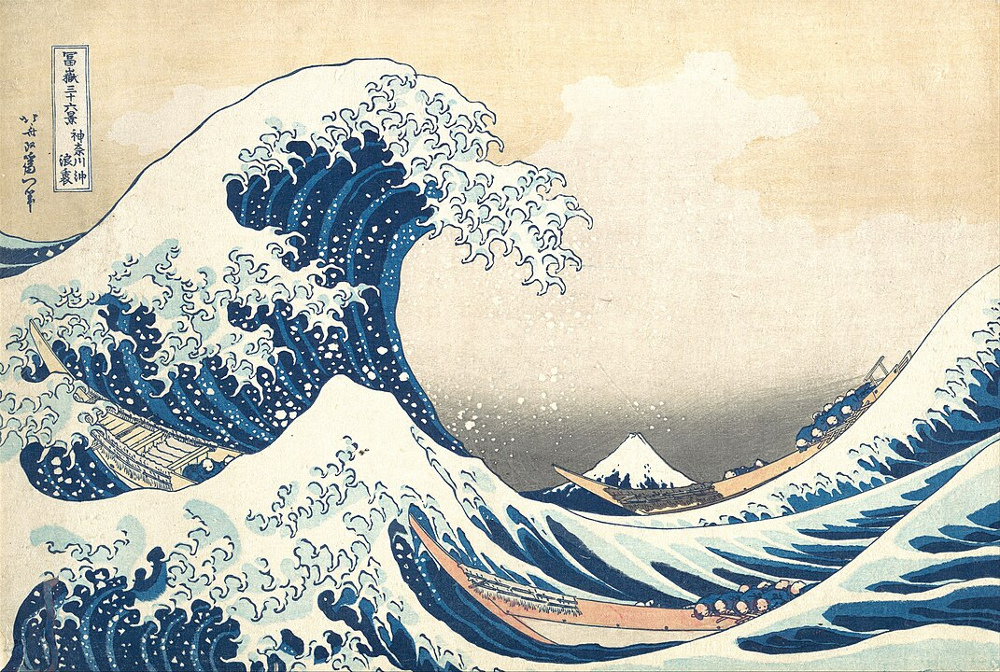

## Who is it that's aware I'm thinking?

That question didn't arrive in stillness. It came from suffering. The quiet kind. The kind that hums beneath the surface, wearing you down not with noise but with weight.

I wasn't looking for a self-help breakthrough. I was just trying to breathe through the ache. Watching. Listening. Observing the chaos of my own mind. And then it hit me like cold sea spray in the face. Not because I didn't know the answer. But because I'd never really asked. 

## Something subtle, seismic, had shifted.

At first, it was just a sense—a distance between the thoughts and the one observing them. The realisation that I could watch them rise and pass like waves.

> A wave is not separate from the ocean. It is the ocean, briefly in motion.

So what if I'm not the wave?

What if I'm the ocean?

<figure style="text-align: center;">
  
  <figcaption style="font-size: 0.9em; color: #666; margin-top: 0.5em;">
    <em>The Great Wave off Kanagawa</em> — Katsushika Hokusai
  </figcaption>
</figure>

This isn't some new-age abstraction. It's painfully practical. Most of the suffering I've experienced—the addiction, the anxiety, the shame, the grasping—has come not from reality but from thoughts about reality.

The inner narrator. The endless rehearsal. The story of who I think I am, what I should have done, how it might all fall apart.

But if I can observe the story, then maybe I'm not in it. Perhaps I'm the one watching.

## Consciousness
Pondering, not as a neuroscientist, a physicist, or a yogi.
As a man who burned his old life to the ground and started asking real questions.

What is this awareness? Where does it come from? Why does it feel like my sense of self has a beginning and an end?

## Not the usual suspects of self-discovery. 

Back at University, while meandering through the field of AI, I stumbled upon "The Emporers New Mind",—in which [Roger] Penrose argues that human consciousness is non-algorithmic and thus is not capable of being modelled by a conventional Turing machine—the digital computer.

Now, he's returned to my thoughts along with [Stuart] Hameroff and Orch-OR. Their theory of quantum consciousness offered something few others could: not as settled science, but as a provocative bridge between mind and matter.

Maybe consciousness arises not from computation or cognition but from the collapse of quantum wave functions in microtubules (tiny structures inside our neurons).

Each collapse, a ripple of awareness. Each ripple, a wave.

## The Illusion of Separation

And here's the part that rearranged something in me:

These collapses might not be local. Not confined to this body or brain. They might be tied to the structure of spacetime itself. Which means the awareness I call "me"... is a temporary crest. A pattern. A localised echo of a universal hum.

The ocean, singing through a wave.

That's not a comforting idea. It's not spiritual escapism. It dismantles the illusion of control, of permanence, of separation. Liberation. Because if I'm not just the wave—if I am the ocean, becoming a wave—then death isn't an end. It's a return. A folding back into the vastness I never truly left.

And maybe that's why some places feel sacred.  
Some people feel familiar.  
Some moments feel timeless.

Maybe they are.

## For now
I'm unsure if any of this is empirically true, but it resonates deeply with my experience.

I still have thoughts.  
But I don't believe all of them.

I still feel fear.  
But I know I am not it.

I am the wave that wonders.  
And the ocean, wondering.